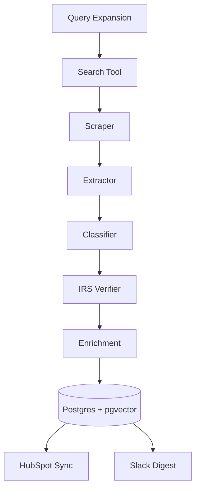

# Autonomous Lead‑Miner Agent
*Product Guide & PRD*
**Version:** 1.0 — July 16 2025

---

## 1 · Executive Summary
Sales teams that target U.S. nonprofits running travel‑package auctions lose hours googling galas and scrolling social media.  
The **Lead‑Miner Agent** automates that research: every night it searches the web, reads pages, classifies relevance, verifies nonprofit status, enriches contact data, and writes structured leads into your CRM.

---

## 2 · Goals & Success Metrics
| Goal | Metric | Target |
|------|--------|--------|
| Fresh, qualified leads | Valid leads per day | **≥ 15** |
| Precision | False‑positive rate | **≤ 10 %** |
| Latency | Page → CRM | **< 2 h** |
| Cost | USD per valid lead | **≤ 0.25** |

---

## 3 · Personas
* **Charlie (Regional Director)** – needs a daily drip of warm leads.  
* **Sierra (SDR)** – first‑line qualifier; wants leads in HubSpot with minimal cleanup.  
* **Alex (Growth Ops)** – maintains the agent, cares about uptime & cost.

---

## 4 · Use‑Case Stories
1. *As Charlie*, I see only U.S. nonprofit travel‑package auctions in HubSpot each morning.  
2. *As Sierra*, I double‑check the event URL, confident irrelevant school raffles were filtered out.  
3. *As Alex*, I tweak the keyword list in `config.ts` and redeploy within minutes.

---

## 5 · Functional Requirements
### 5.1 Pipeline Stages
1. **Query Expansion** – Generate ~50 long‑tail queries daily.  
2. **Web Search** – Fetch top 20 URLs per query with SerpAPI; respect rate limits.  
3. **Content Extraction** – Download HTML, strip boilerplate, keep `<main>` text.  
4. **Relevance Classification** – LLM decides if page is (a) auction/raffle, (b) travel package, (c) nonprofit.  
5. **U.S. Verification** – Look for ZIP/state or hit IRS 990 / GuideStar API.  
6. **Dedup & Enrich** – Vector‑dedupe titles; pull LinkedIn org & staff size.  
7. **Delivery** – Upsert to HubSpot and post Slack digest.

### 5.2 Non‑Functional
* Handle 5× seasonal traffic.  
* Enforce budget cap via usage API.  
* Respect robots.txt and CAN‑SPAM.

---

## 6 · Architecture



### 6.1 OpenAI Agents SDK (TypeScript)

```ts
import { Agent } from "openai-agents-js";

export const leadMiner = Agent.compose([
  queryExpansionTask,
  searchTask,
  extractTask,
  classifyTask,
  verifyTask,
  enrichTask,
  deliverTask,
]);
```

---

## 7 · Data Model (TypeScript)

```ts
export interface Lead {
  id: string;            // UUID
  orgName: string;
  ein?: string;
  eventName: string;
  eventDate?: Date;
  url: string;
  travelKeywords: boolean;
  auctionKeywords: boolean;
  usVerified: boolean;
  score: number;
  contactEmail?: string;
  createdAt: Date;
}
```

---

## 8 · Tech Stack
* **Orchestration:** OpenAI Agents SDK (TS)  
* **LLM:** o4-mini (reasoning tasks) + gpt-4.1-mini (no-reasoning tasks & image analysis)  
* **Search:** SerpAPI  
* **Data:** Postgres + pgvector  
* **Queue:** BullMQ (Redis)  
* **Deploy:** Fly.io or AWS ECS Fargate  
* **Monitoring:** OpenTelemetry → Grafana

---

## 9 · Timeline
| Week | Deliverable |
|------|-------------|
| 1 | Repo scaffold, hello‑world agent |
| 2 | Search + scrape integrated |
| 3 | Classifier prompt, IRS tool, schema |
| 4 | HubSpot sync & Slack digest |
| 5 | QA + precision tuning |
| 6 | Production launch |

---

## 10 · Risks & Mitigations
* **LLM hallucination** → self‑consistency + human review bucket.  
* **Site blocking** → rotate IPs; obey crawl delay.  
* **Cost overrun** → budget alerts; cheaper first‑pass model.

---

## 11 · Acceptance Criteria
* ≥ 90 % pilot‑week leads are correct.  
* First Slack digest by 9 AM PT daily.  
* Cost ≤ $0.25 per lead at 1 K leads / month.

---
